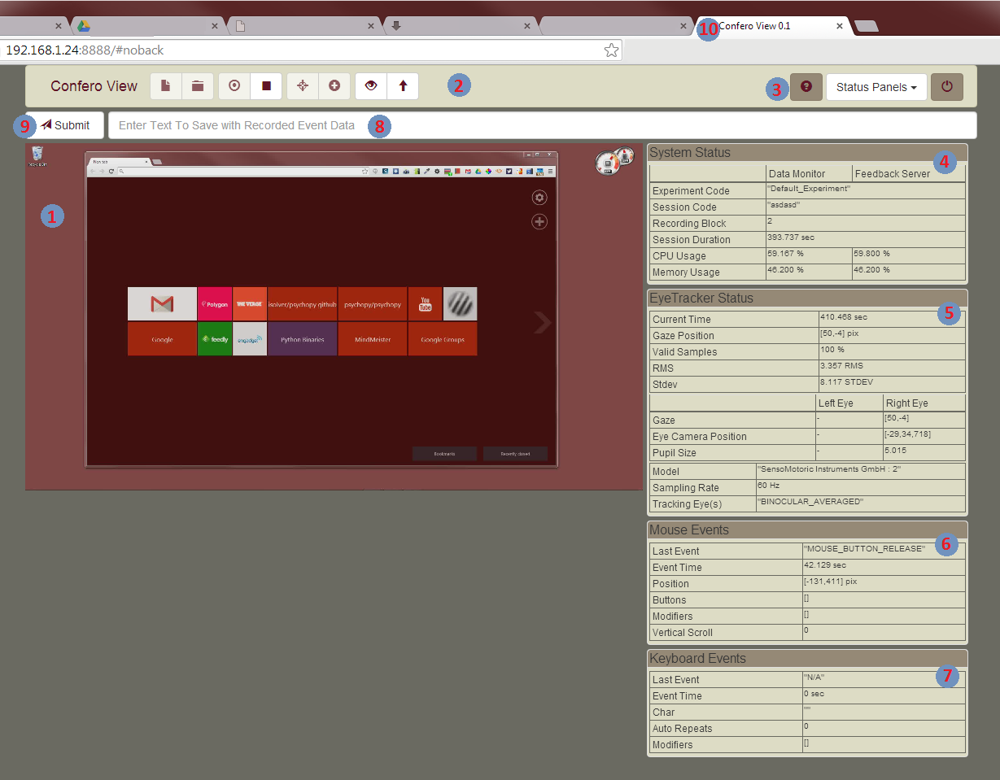

========================
Confero View WebApp UI
========================

Confero View includes a web browser based user interface, used to control the
Confero Track application as well as view the screen capture video and device
event statuses in real-time.

Tested Web Browsers
====================

The Confero View WebApp has been tested using Google Chrome on Windows 7.
Do not use any other browser at this time, as the stability of the WebApp
has not been verified in any browser but Chrome.

User Interface Overview
========================

1. The Screen Capture Video being captured from the Confero Track Display. The
   video is updated in real-time. The delay between the Confero View screen state
   and when the screen capture displaying that state is shown on the WebApp will
   vary depending on the computer hardware being used. A delay of 1 second or less
   is common.

2. The left side of the application toolbar, containing:

   * Create & Close Experiment Session Buttons.
   * Start & Stop Data Recording Buttons.
   * Begin Eye Tracker Calibration and Validation Buttons.
   * Screen Capture Video Overlay graphics toggle buttons for the gaze and mouse positions.

.. note:: Only buttons which perform actions that are allowed for the current
          Confero Track application state can be clicked. The 'invalid' buttons
          are disabled.

3. The right side of the application toolbar, which includes:

   * Open User Manual Button: Opens the Confero User Manual in a new browser tab.
   * Device Status Panel Drop Down List,
   * Quit the Confero View and Track applications Button.

4. **System Status Panel**. The name of the open experiment and session are displayed,
   as well as the current CPU and memory usage of both the Confero Track and
   Confero View applications.

5. **Eye Tracker Status Panel**. Provides information about the eye tracker
   data being collected when data recording is enabled.

6. **Mouse Status Panel**. Provides information about any mouse related events
   that occur when data recording is enabled. The current mouse pointer position
   is also provided.

7. **Keyboard Status Panel**. Provides information about keyboard press and release
   events as they occur.

.. note:: Pressing the title text of any of the Status Panels will collapse the
          panel body, leaving only the title bar. Press the text on a collapsed
          status panel, and the contents of the panel expand back in the UI.
          This is a fast way to high a device status panel if the information
          provided in that panel is not relevant for the current experiment.

8. A text line allowing observations or comments to be made by the experimenter
   during data collection. Each message can be up to 128 characters in length.
   By pressing enter in the text line, or by pressing the Submit button ( 9 ),
   the message text is time stamped and stored with all the other event
   data being collected.

10. The Chrome Browser Tab that the Confero View WebApp is running in.

Important Confero View WebApp *Do Not's*
=========================================

.. danger:: Do not close the browser tab Confero View is running in, without first
            shutting down the Confero software correctly.

.. danger:: Do not press the 'refresh' or 'reload' button on the Confero View
            browser tab when the software is running. Doing so will cause the
            two applications to get out of sync. Forcing the restart of both applications
            is the only way to recover from this.

.. danger:: Do not press the 'back' or 'forward' button on the Confero View
            browser when the software is running. Doing so will cause the
            two applications to get out of sync. Forcing the restart of both applications
            is the only way to recover from this.
