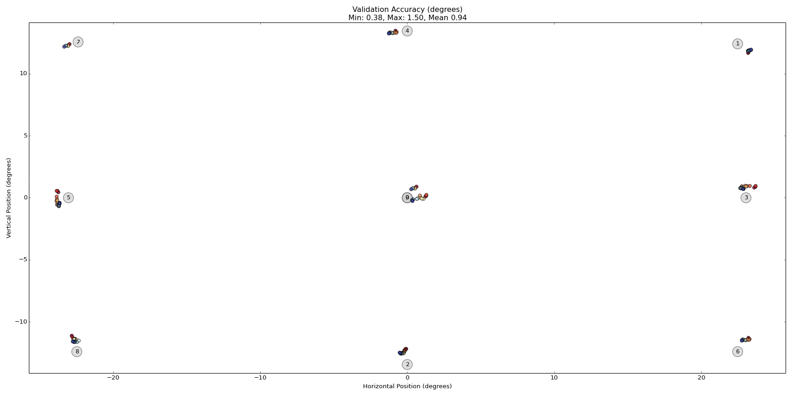
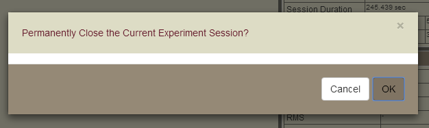

.. _getting_started_page:

===============================
Getting Started
===============================

This section provides an overview of how to use the Confero system in the
form of a generic, but complete, tutorial on using the Confero
View and Track applications.

.. note:: The instructions provided in the :ref:`installation_page`
  section must have been completed before this tutorial can be started.

Starting Confero View and Track
===================================

1. Launch Confero View
--------------------------

From the computer Confero View was installed on, start the software by
double clicking on the ``CONFERO_DISTRO_ROOT\ConferoView.bat`` file.

.. warning:: Only run one instance of Confero View at a time. Starting > 1
  Confero View application will cause the existing Confero View instance to
  fail.

By default, once Confero View has started, Google Chrome should open a new tab
that displays the Confero View WebApp.

   When the Confero View WebApp is started but the Confero Track application is
   not yet running, the WebApp will wait for a connection from Confero Track
   before allowing it to be used. This is required so that the list of available
   Experiments can be provided to the WebApp.

.. danger:: Never press the web browser's refresh, back, or forward buttons
  when using the Confero View WebUI. This will cause the application to fail,
  including possible loss of data if recording was occurring.

2. Create an Experiment Folder (Optional)
------------------------------------------

The computer running Confero Track is also the computer that any screen capture
video's and device event data files are saved. The root folder for all files
saved by Confero Track is ``CONFERO_TRACK_ROOT\Results``.

   An example Confero Track Results Folder, with two user created experiment
   results folders ( ExperimentA and ExperimentB ) in addition to the default
   experiment results folder ( Default_Experiment ).

Each folder within the ``CONFERO_TRACK_ROOT\Results`` Directory
is the name of one of the possible experiment's that can be selected when
the Confero View WebApp is launched. The selected experiment name / results folder
is used to create new Experiment Sessions and save any Data Recordings run for
the currently open experiment session.

.. note:: There is always a ``Default_Experiment`` folder created within
          the ``CONFERO_TRACK_ROOT\Results`` directory so that at least one
          experiment name option is available for selection from the Confero
          View WebApp.

1. To add a new experiment to the Confero system, simply add a folder
   to the ``CONFERO_TRACK_ROOT\Results`` directory.

2. Name the folder using the new experiment name to be used. As an example,
   the following image shows a new experiment called ``MyExperiment`` added
   to the ``CONFERO_TRACK_ROOT\Results`` directory.

.. warning:: Unless explicitly instructed to do so, never remove experiment
  folders from ``CONFERO_TRACK_ROOT\Results`` after any amount of data has been
  collected for that experiment.

3. Launching Confero Track
---------------------------

1. From the computer Confero Track was installed on, start the software by
   double clicking on the ``CONFERO_DISTRO_ROOT\ConferoTrack.bat`` file.

.. note:: Ensure that Confero View software is already running on the
  other computer before starting the Confero Track software. Otherwise the
  Confero Track application may exit because it could not connect to the
  Confero View application before timing out.

.. warning:: Only run one instance of Confero Track at a time. Starting > 1
  Confero Track application at a time will cause the existing Confero View
  application to fail in unexpected ways.

Confero Track does not have a GUI interface. When started, a command prompt
window will appear and text should be printed indicating that Confero Track
found, and connected to, Confero View.

Preparing for Data Collection
===============================

4. Select an Experiment Folder
-------------------------------

Once the Confero Track application is running, the Confero View WebApp's
experiment selection dialog is automatically updated with all available
Experiment Folders.

1. Select the desired experiment name from the Confero View experiment
   selection dialog.
2. Press the dialog's Start button.

   The Confero View WebApp after Confero Track has been started. The experiment
   to use for Session Creation and Data Recording can now be selected.

5. Create an Experiment Session
--------------------------------

Once an experiment has been selected, the Confero View WebApp can start to be
used.

The next step is to create an experiment session to hold data recordings
for that session. Usually a new session is created each time a participant runs
the experiment protocol.

.. note:: Data can not be recorded unless a session is open.

.. warning:: A session can only be created when there is no session already
             active. To create a new session in this case, first close
             the current session.

1. To create a new session, press the ``Start Experiment Session`` button in
   the WebApp toolbar.

2. A dialog will appear where a code for the new session can be entered.

3. Enter the session code in the text line and then press the OK button

4. When the OK button is pressed, Confero View communicates with Confero Track
   requesting that a new session with the provided session code be created.
   If successful, an info balloon will appear indicating success.

5. Also note that several of the toolbar buttons have changed state, allowing
   session related actions to be started.

.. note:: Each session in an experiment must have a unique session code
          assigned to it. If a session code is entered that is already in use,
          an error alert will be displayed indicating so.
          Reenter a new unique session code and continue.

When an Experiment Session is open, Confero Track has connected to
and initialized the experiment's devices, including the eye tracker being
used for eye data collection. However **No data is actually being recorded** yet.

6. Perform Eye Tracker Participant Setup
-----------------------------------------

Now that an Experiment Session has been created and is open, setup of the eye
tracker being used is likely required.

1. Details on the physical setup of the participant relative to the eye tracker
   is out of scope for this document. Please refer to the eye tracker
   documentation.

2. Once the participant is positioned correctly, etc, eye tracker calibration
   and then validation can be started via the Confero View WebApp.

6a. Run Calibration
~~~~~~~~~~~~~~~~~~~~

1. Start the eye tracker calibration procedure by pressing on the Confero View
   WebApp's ``Start Calibration`` button. This instructs the Confero Track
   software to start the eye tracker calibration routine for the eye tracker
   model being used.

.. note:: The specific procedure to follow during the calibration phase of the
          eye tracker is somewhat model specific. Please refer to the ioHub
          Eye Tracker documentation for the model being used for more details
          on the calibration process specifics. ** Referenced doc's are very
          out of data and need to be updated**

2. Once the calibration procedure has completed and exited from the Confero Track
   computer, an information balloon will appear indicating that Calibration is
   complete.

.. image:: ./images/calibration_successful_ballon.png
   :align: center

6b. Validation
~~~~~~~~~~~~~~~~

After Calibration, it is typically good practice to perform a Validation
procedure that determines the accuracy of the calibrated eye data. This process
is identical regardless of the eye tracker model being used.

1. Start the eye tracker Validation procedure by pressing on the Confero View
   WebApp's ``Start Validation`` button. This instructs the Confero Track
   software to start the eye tracker Validation routine on the data collection
   computer.

2. When Validation starts, the Confero Track computer screen switches to a full
   screen graphics mode, with text being displayed indicating how to start the
   Validation process from the Confero Track computer.

3. Start the Validation sequence by pressing the space key
   **on the Confero Track** computer. The experimenter or participant can press
   the space button. It is up to the experimenter to decide which is more
   appropriate.

4. As soon as the space bar has been pressed, a central fixation target will be
   displayed on the Confero Track computer screen. The participant must focus
   on this target as quickly as possible.

5. The fixation target will moved to different locations on the screen.

.. note:: The specific graphics used for the fixation target,
   how it moves from one position to the next, and how many validation
   positions are used, is all determined by settings ion the
   ``CONFERO_TRACK_ROOT\Results\validation_config.yaml`` file. See the
   :ref:`config_files_page` section of this manual for details.

6. Regardless of the validation graphics specifics, the participant must follow
   the target stimulus as accurately as possible, always looking as close as
   possible to the target center.

7. When the Validation process completes, an image displaying the results of the
   validation data is displayed. Ensure that the calculated accuracy stat's are
   within the limit's defined by the experimenter as being acceptable for
   the given experiment.

8. To complete the Validation procedure, press the space bar on the Confero Track
   computer. The validation results screen will close and the display will return
   to the operating system desktop and applications.

9. When the validation procedure has completed, an information balloon will
   appear in the Confero View WebApp indicating that Validation is complete.

.. note:: While an experiment session is open, and data recording is disabled,
          preforming eye tracker Calibration and Validation can be done as many
          times as is needed.

Collecting Data and Performance Monitoring
===========================================

7. Start Data Recording
------------------------

With an experiment session open, screen capturing and data recording can be
started using the Confero View WebGui.

1. To start recording of screen capture video and user event data on the
   data collection computer, press the ``Start Recording Data`` button in the
   Confero View WebApp.

2. The Confero Track application will be instructed to start the screen capture
   video saving process and to start recording any events received from devices
   such as the keyboard, mouse, and eye tracker.

3. On the Confero Track computer monitor, a small white box in the upper left
   hand corner of the screen will flash several times and then stop after about
   2 seconds. This is expected behaviour from the Confero Track application.

4. Once the recording process has successfully started, an information balloon
   indicating so is displayed in the Confero View WebApp. The Screen Capture
   video stream will start, providing a real-time view of what is occurring on
   the participant's computer monitor. The device status panels will also start
   to be updated with the current event status of the eye tracker, keyboard,
   and mouse.

8. Monitor Participant and Equipment Performance
--------------------------------------------------

While Data Recording is enabled, the Confero View WebApp provides a way for the
experimenter to visually monitor the performance of the participant and the
quality of data being collected.

Confero View also supports the generation of Alerts based on the value of one
of the device status panel field values. Two levels of Alerts can be generated,
Warnings and Errors. The specific conditions that can trigger a warning or error
alert is defined by the experimenter with the Confero View application
configuration file.

.. note:: The specific conditions that can trigger a warning or error
          alert are completely configurable via the
          ``CONFERO_VIEW_ROOT\settings\app_config.yaml`` file. The way Alerts
          are configured is discussed in detail in the :ref:`config_files_page`
          section of this manual.

Warning Alerts
~~~~~~~~~~~~~~~

Warning Alerts are used to indicate that some aspect of the data being collected
has reacted a value threshold where extra attention should be given. If the
warning stops, no action is usually required by the Experimenter.

Warning Alerts should occur prior to an Error Alert for a given device
status field. When a Warning Alert occurs for a device field:

* The device status table cell that holds the value which is triggering the
  Warning Alert changes color to Yellow.
* (Optionally) A Warning Alert Balloon will appear indicating what the Warning
  is about.

Error Alerts
~~~~~~~~~~~~~~~

Error Alerts usually occur following a Warning Alert status level for a given
device field. Errors are used to indicate that some aspect of the data being
collected has reached a value threshold where the data being collected is
likely severely compromised, so some action should likely be taken by the
experimenter to correct the condition.

Since the Confero View Alert system is completed configurable by the
experimenter, and the action to take obviously depends on
the specific Error Alert being generated, providing a list of specific Alerts
and the action that should be taken under such a condition is beyond the
scope of this document.

When an Error Alert occurs for a device field:

* The device status table cell that holds the value which is triggering the
  Error Alert changes color to Red.
* (Optionally) An Error Alert Balloon will appear indicating what the Error
  is. Usually this balloon will not disappear automatically like other balloons
  discussed. Instead the Error Balloon needs to be closed manually by the
  researcher.

9. Stop Data Recording
------------------------

If the Confero Track application is already recording data,

1. To stop recording of screen capture video and user event data on the
   data collection computer, press the ``Stop Recording Data`` button in the
   Confero View WebApp.

2. The Confero Track application will be instructed to stop the screen capture
   video saving process and to stop recording any device events from the
   keyboard, mouse, and eye tracker.

3. On the Confero Track computer monitor, a small white box in the upper left
   hand corner of the screen will flash several times and then stop after about
   2 seconds. This is expected behaviour from the Confero Track application.

4. Once the recording process has successfully stopped, an information balloon
   indicating so is displayed in the Confero View WebApp. The Confero View
   Screen Capture view is cleared and the status of the keyboard, mouse and
   eye tracker devices is reset and cleared.

.. note:: While an experiment session is open, starting and stopping data
          recording for that session can be done as many times as is required.

Closing Shop
=============

10. Close the Experiment Session
--------------------------------

After all the necessary data has been recorded for the currently open
experiment session, the session can be closed. After a session is closed, a
new session can be started, or the Confero software can to shut down.

1. To Close the current Experiment session, press the
   ``Close Current Experiment Session`` button in the
   Confero View WebApp.

.. warning:: Once an Experiment Session is closed, it can not be reopened and
             no further data collection for that session is possible.

2. A dialog will be displayed asking for confirmation to close the current
   experiment session. Press ``OK`` to proceed, or ``Cancel`` to return to the
   Confero View WebApp without closing the session.

11. Shut Down the Confero Software
-----------------------------------

1. When Confero View and Confero Track should be shut down, both applications can
   be ended by pressing the ``Quit Confero View and Track`` button in the
   Confero View WebApp.

2. A dialog will be displayed asking for confirmation to shut down both of the
   Confero programs. Press ``OK`` to proceed with shut down, or ``Cancel`` to
   return to the Confero View WebApp.

3. When the software has shutdown, the web browser window which was running the
   Confero View WebApp is redirected to a static web page.

